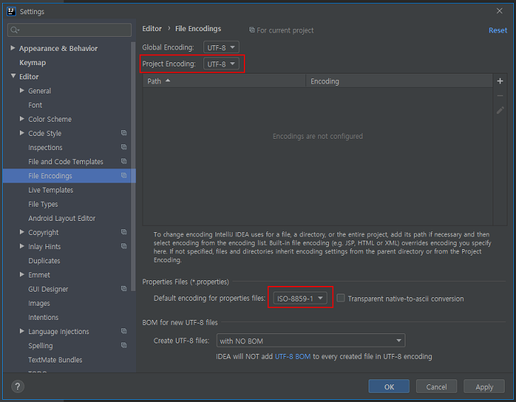
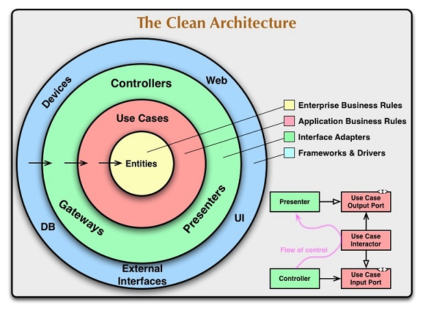
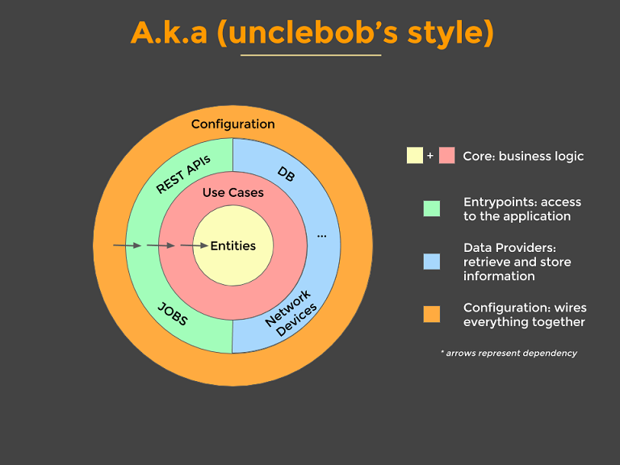
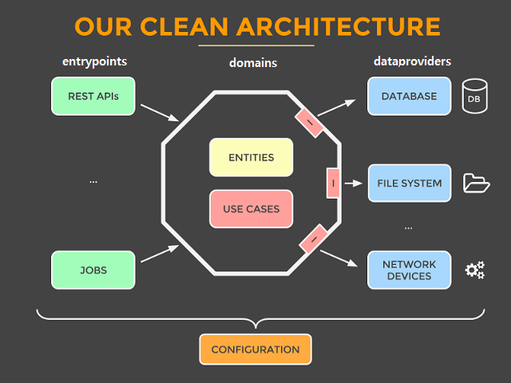
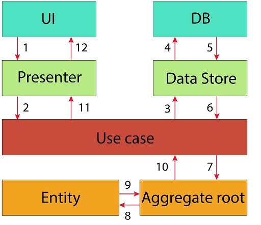
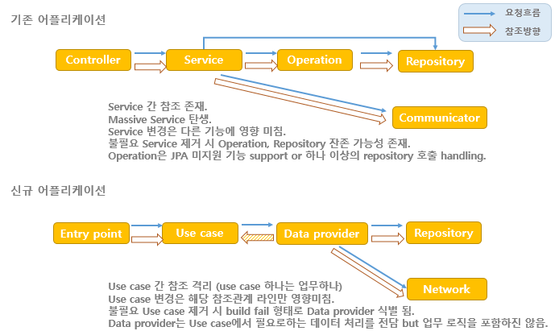

## 어플리케이션 개요
> 본 어플리케이션의 역할. 구성에 대한 짧은 소개.


## Prerequisite
* Java 8 이상
* Gradle 6.x
* SpringBoot 2.2.x
* MySQL 5.
* MongoDB 4.2
* Redis
* Kafka 2.X
* use case, domain, entity, vo, dto 정의와 차이를 구체적으로 이해.

## Developer Settings
소스를 포함한 모든 text file 인코딩은 UTF-8으로 설정.
> 예외로 .properties 파일은 IOS-8859-1 임.



## Build

## Start up


## 어플리케이션 구성
> 어플리케이션 구성의 컨셉은 Clean Architecture에 기반하고 Hexagonal 개념으로 구조를 잡음.
> 우리가 만드는 어플리케이션의 중심은 database나 framework가 아니다.
> 우리가 만드는 어플리케이션의 중심은 use cases(요구기능,비지니스) 이다.

| 클린아키텍처  | 로버트 C. 마틴 버전  |
|---|---|
|||


| 우리의 접근 방식  |  flow  |
|---|---|
| | |


#### 구성 요소별 역할, 특징
#### #Entity
* 도메인 객체를 의미 - 대규모 프로젝트 레벨의 비즈니스 규칙을 캡슐화.
  ex) 교환국, 게시글
* 엔티티별(entity-specific) 비지니스 룰을 포함 - 메서드를 갖는 객체 일 수도 있지만 데이터 구조와 함수의 집합일 수도 있음.
  ex) 일자 포맷
* 바깥쪽에서 무엇이 변경되더라도 가장 바뀌지 않는 영역.
* 명확한 타입을 권장.
  ex) 문자열 보다는 Hostname
* No Frameworks

#### #Use Case
* 순수한 비지니스 로직 - 애플리케이션 고유 비즈니스 규칙을 포함.
* 데이터를 위한 인터페이스 정의.
* entities와 dataproviders를 사용 해 유스케이스의 목적을 달성.
* 이 계층의 변경이 엔티티에 영향을 주지 않을것을 기대함과 동시에 UI 또는 프레임워크의 변경에 영향을 받지 않을것도 기대.
* 비지니스 예외를 throws 함.
* database나 presentation 변경에 영향을 받지 않음.
* Plain Java (No Frameworks)

#### #Data Provider
* use case 에서 정의한 interface를 구현. - 잊지말자 use case를 지원하는 repository method가 존재할 뿐이다.
* 데이터가 어디로부터 오는지 등의 모든 상세를 감춤.
  ex) 데이터 원천이 DB인지 file인지 network 건너 다른 datasource인지.
* 다중 구현이 될 수 있음.
* 어떤 framework/library 도 적용 가능.
  ex) Hibernate, spring-jdbc, snmp4j
* ORM을 도입한다면 business entity와는 별개의 orm용 entity 구성 필요.

#### #Entrypoint
* use case 의 시작(호출) 점.
* business logic 존재하지 않음.
* 입출력 conversion logic, 입력값 검증, 인증/인가 처리.
  ex) DTO를 웹,GUI 응답으로 전환
* 모든 전달 메커니즘(입출력)을 감춤.
* GUI 역시 entrypoint가 될 수 있음.
* 어떤 framework/library도 적용 가능.
  ex) spring-mvc, quartz, jersey

#### #Configuration
* 나머지를 동작케 하는 모든 지저분한 상세는 여기 존재.
  ex) web server setup, initialize datasource
* 나머지 모두를 엮음(wires)
* framework를 격리하고 감춤.
  ex) spring은 이 영역에만 존재 함.

## CQRS 패턴 고려
도메인(업무분석)의 복잡도 증가의 큰 원인 중 하나를 동일한 도메인으로 조회,변경 업무를 처리하기 때문이라는 분석에서 출발.
<-- CQRS는 단일 모델 사용에따른 복잡도 해소를 위한 디자인 패턴.
<-- 클린 아키텍처, CQRS 패턴 모두 도메인을 중심으로 다루기때문에 두 컨셉을 혼합하는데는 아무런 문제가 없음.
<-- command, query를 명시적 구분하지 않더라도 명령용 도메인과 질의용 도메인 객체를 분리하는것만으로도 소기의 목적은 달성 가능할것으로 보임.


## modules & packages
> 패키징 전략으로 Package by Feature 를 선택 함.
> * package by layer 보다 package principles 을 더 잘 지킬 수 있음.
>   ex) 접근제한자
> * package by layer 전략은 어플리케이션이 커지고 복잡해짐에 따라 여러 패키지를 넘나들며 수정을 가해야 함.
> * 여러 이유로 두 진영 논쟁에서 Package by Feature 쪽이 더 지지를 받고 있음.

```
 package principles

 REP  패키지 릴리스/재사용 등가 원칙
      재사용 그룹의 클래스들은 한 패키지 안에 들어가야 함
      재사용할 사람들이 편하게 사용할 수 있는 방향으로 릴리즈되고 유지 보수 되어야 함
 CRP  공통 재사용 원칙
      서로 다른 클라이언트가 사용하는 클래스들을 최대한 분리해야됨
 CCP  공통 폐쇄 원칙
      클래스를 변경할 이유는 오직 하나뿐이다의 원칙을 패키지에 확장
      변경 시 그것 때문에 바꾸어야할 클래스들이 단 한 패키지에만 몰려있어야 함
      변경 가능성이 비슷한 클래스들을 하나로 묶는 것
 ADP  의존 관계 비순환 원칙
      패키지 의존 관계 그래프에 순환이 있다면 서로 개발에 영향을 받게 됨
 SDP  안정된 의존 관계 원칙
      모든 패키지 의존 관계 화살표는 의존하는 패키지 보다 변경하기 어려운 패키지를 가리킴
 SAP  안정된 추상화 원칙
      추상 클래스와 인터페이스의 비율이 높을수록 패키지의 추상도도 높아짐
      패키지가 의존 관계를 많이 받아들일 수록 패키지도 더 추상적이 되어야 함
```


#### #소스 패키지 구조 (제안)
```
클래스, 패키지 배치 원칙
- (운영 시점에, 동료 개발자가) 요건 변경에의한 코드 변경이 예상하지 않은 다른 usecase에 영향을 미치지 않도록 하는 관점으로.

configurations/      entrypoints, domain, dataproviders 를 엮는 전체 설정.
  spring/
    ApplicationMain.java
    DatabaseConfig.java
    ElasticsearchConfig.java
    RedisConfig.java
    SwaggerConfig.java
  console/

entrypoints/         usecase 트리거링, 입출력 포맷 전환, 입력값 validation, 인증/인가 처리, 예외 응답.
  rest/
    aop/
      AdminCheck.java
      AdminCheckAspect.java
    filters/
    exceptions/
      DuplicateKeyException.java
    feed/
      xxxMapper.java
      FeedAdminController.java
      FeedOwnerController.java
      FeedPublicController.java
    reply/
      ReplyAdminController.java
      ReplyOwnerController.java
      ReplyPublicController.java
  streams/
    StreamConsumer.java
  jobs/
    Scheduler.java

domains/
  exceptions/
  feed/                    repository 중심이 아닌 업무(도메인, use case)기준 패키지 구성
    xxxDomainEntity.java   repository entity와 구분하기위해 DomainEntity suffix 사용. command, query 도메인 분리 정의 가능.
    xxxUsecase.java
    xxxDataprovider.java
  reply/
  reaction/

dataproviders/        도메인 모듈의 Dataprovider interface를 구현
  xxxDataproviderImpl.java   Dataprovider 구현체는 repository 의존이 아닌 domain 의존성임. database, network, elasticsearch, 외부API 등을 사용함.
  FeedDataproviderImpl.java
  database/
    mongo/             read, write datasource 분할 적용방식 검토.
      xxxEntity.java   엔티티는 스키마의 표현이고 read, write 기능으로 분리하는 개념 아니므로 read, write 패키지 밖에 위치.
      read/
        xxxRepository.java
        xxxRepositoryCustom.java
        xxxRepositoryImpl.java
      write/
    mysql/             configuration 측 basePackages 기준으로 datasource 분할 설정 지원을 위해 패키지 분리
      read/
      write/
  elasticsearch/
  network/
    MemberAPI.java
    CharaterAPI.java
  kafka/
    StreamProducer.java
  redis/
```


#### #상기 구조를 통해 얻을 수 있는 장점
* 비교적 명확한 규율을 통한 팀 best practice 수립
* 효과적인 테스트 전략 수립 가능
  TDD - BDD - Integration - End to End
* Framework를 격리했기때문에 결정을 미루기(변경하기) 쉬움.
* Database로부터 독립
  비지니스 수행을 위한 endpoint와 스키마를 개념수준에서 분리.
* 아키텍처가 힘을 발휘함.
  아키텍처의 중심에는 use case가 있다.
  웹은 전달 메커니즘(입출력장치)이며, 어플리케이션이 웹을통해 전달한다는것은 세부사항이지 시스템을 지배해서는 안됨.
  프레임워크는 매우 강력하고 유용한 도구이긴하나, 삶의 방식(유스케이스)는 아님.
  아키텍처가 use case를 최우선으로하고 프레임워크와 적당한 거리를 유지하면 프레임워크를 전혀 준비 하지 않아도 모든 유스케이스에대한 단위테스트가 가능.
* 모든 비지니스로직은 use case에 존재
* 잘못된 짓을 하기 어려움.
* 하나의 use case를 두고 동시에 작업이 가능.
* Monolith로 쪼개기 쉬움.

#### #상기 구조를 취할 경우의 단점
* 명시적 코드 중복이 발생할 수 있음.
* 비지니스로직에 관심을 가져야만 함.


## 프로젝트 구성
#### 프로퍼티 값 암호화

#### QueryDSL

#### Circit Breaker

#### XSS 처리

#### 객체 매핑

#### 환경별 profiles

## REST API 작성 가이드
* Content-Type은 application/json
* @PostMapping() , @GetMapping()보다는 @RequestMapping() 어노테이션을 사용한다.
`
API(https://docs.spring.io/spring/docs/current/javadoc-api/org/springframework/web/bind/annotation/PostMapping.html)
에서 명시하듯 @RequestMapping(method = RequestMethod.POST) 의 shortcut 그 이상도 이하도 아님.
경험상 IDE 나 text 검색 도구를 통한 전체 API URI 검색이 불편함.
`
* path는 소문자를 사용한다.
* URI 마지막에 `/` 를 포함하지 않는다.
`
http://api.onstove.com/timeline/v1.0/user
`
* 언더바(_)가아닌 대시(-)를 사용한다.
`
http://api.onstove.com/timeline/v1.0/feed-commnets
`
* 컨트롤 자원을 의미하는 URL 예외적으로 동사를 허용한다.
`
http://api.onstove.com/timeline/v1.0/feed/duplicate
`
* POST 요청에의해 신규로 생성된 리소스의 고유식별값은 Content-Location Header를 통해 응답한다.  
~~~
POST /timeline/v1.0/feed
{
  "title":"안녕"
}

response header
Contnet-Location:/timeline/v1.0/feed/1
~~~  

* `Method는 GET, POST, PUT, DELETE 허용`이기에 verbose를 path에 기술할 필요는 없으나 모니터링도구, 로그운영 식별의 편의를 고려하여 path에 Update, Delete 에관한 힌트 허용.    
~~~
POST http://api.onstove.com/timeline/v1.0/create/feed

GET http://api.onstove.com/timeline/v1.0/read/feed/1

PUT http://api.onstove.com/timeline/v1.0/update/feed/1

DELETE http://api.onstove.com/timeline/v1.0/delete/feed/1

POST http://api.onstove.com/timeline/v1.0/like/reply/1

POST http://api.onstove.com/timeline/v1.0/claim/reply/1

GET http://api.onstove.com/timeline/v1.0/search/feed?q=

GET http://api.onstove.com/timeline/v1.0/list/feed?sort=
~~~  


* URI에 불필요한 path를 추가하지 말자 - 3 depth 이내. /{value1}/{value2}/{value3} 형식은 지양. /key1/{value1}/key2/{value2}/key3/{value3}  
~~~
다양한 조건을 path에 넣을 필요는 없다. 쿼리스트링을 활용하자. 요즘은 GET에도 request body 활용.
GET http://api.onstove.com/timeline/v1.0/list/feeds?page=&size=&sort=

GET http://api.onstove.com/timeline/v1.0/search/feeds?q=&fields=title,content&sort=
~~~  


* Sort

* Pagenation


## TODO
JSON 형식의 request body의 XSS 처리
TestCase, coverage
Circuit Breaker
openapi 3.0 규약의 swagger 제너레이터 붙이기
* https://stackoverflow.com/questions/55938207/how-to-generate-openapi-3-0-spec-from-existing-spring-boot-app
* https://www.baeldung.com/spring-rest-openapi-documentation

entrypoint, domain, dataprovider 경계 간 객체 매핑 방안
* entity와 domain의 유사성이 높음. domainEntity 를
* https://www.baeldung.com/java-performance-mapping-frameworks

## References
the clean architecture
https://crosp.net/blog/software-architecture/clean-architecture-part-1-databse-vs-domain/
https://crosp.net/blog/software-architecture/clean-architecture-part-2-the-clean-architecture/
https://blog.cleancoder.com/uncle-bob/2011/11/22/Clean-Architecture.html
use case
https://proandroiddev.com/why-you-need-use-cases-interactors-142e8a6fe576
Package by feature, not layer
http://www.javapractices.com/topic/TopicAction.do?Id=205
유스케이스(Use-cases) 개념
https://gisulsa.tistory.com/234
유스케이스 모델링 과정
https://gisulsa.tistory.com/235?category=95571


## miscellaneous

#### # java 8로 빌드한 후 java 11 환경에서 실행 시 boot 과정에 다음과 같은 예외가 확인 됨.
원인은 `cannot access class jdk.internal.misc.Unsafe (in module java.base) because module java.base does not export jdk.internal.misc to unnamed module` 으로 JAVA 실행 옵션을 조정한다.

```
해결 방법
Picked up JDK_JAVA_OPTIONS:  --add-opens=java.base/java.lang=ALL-UNNAMED --add-opens=java.base/java.io=ALL-UNNAMED --add-opens=java.rmi/sun.rmi.transport=ALL-UNNAMED --add-opens java.base/jdk.internal.misc=ALL-UNNAMED -Dio.netty.tryReflectionSetAccessible=true

예외 로그
2020-02-16 16:27:54.756 DEBUG [i.n.u.ResourceLeakDetectorFactory.newResourceLeakDetector:195] Loaded default ResourceLeakDetector: io.netty.util.ResourceLeakDetector@90a85e4
2020-02-16 16:27:54.787 DEBUG [i.n.u.i.PlatformDependent.isOsx0:998] Platform: MacOS
2020-02-16 16:27:54.789 DEBUG [i.n.u.i.PlatformDependent0.explicitNoUnsafeCause0:396] -Dio.netty.noUnsafe: false
2020-02-16 16:27:54.789 DEBUG [i.n.u.i.PlatformDependent0.javaVersion0:852] Java version: 11
2020-02-16 16:27:54.791 DEBUG [i.n.u.i.PlatformDependent0.<clinit>:121] sun.misc.Unsafe.theUnsafe: available
2020-02-16 16:27:54.792 DEBUG [i.n.u.i.PlatformDependent0.<clinit>:145] sun.misc.Unsafe.copyMemory: available
2020-02-16 16:27:54.793 DEBUG [i.n.u.i.PlatformDependent0.<clinit>:183] java.nio.Buffer.address: available
2020-02-16 16:27:54.793 DEBUG [i.n.u.i.PlatformDependent0.<clinit>:253] direct buffer constructor: unavailable
java.lang.UnsupportedOperationException: Reflective setAccessible(true) disabled
	at io.netty.util.internal.ReflectionUtil.trySetAccessible(ReflectionUtil.java:31) ~[netty-common-4.1.45.Final.jar:4.1.45.Final]
	at io.netty.util.internal.PlatformDependent0$4.run(PlatformDependent0.java:225) ~[netty-common-4.1.45.Final.jar:4.1.45.Final]
	at java.security.AccessController.doPrivileged(Native Method) ~[?:?]
	at io.netty.util.internal.PlatformDependent0.<clinit>(PlatformDependent0.java:219) ~[netty-common-4.1.45.Final.jar:4.1.45.Final]
	at io.netty.util.internal.PlatformDependent.isAndroid(PlatformDependent.java:273) ~[netty-common-4.1.45.Final.jar:4.1.45.Final]
	at io.netty.util.internal.PlatformDependent.<clinit>(PlatformDependent.java:92) ~[netty-common-4.1.45.Final.jar:4.1.45.Final]
	at io.netty.util.HashedWheelTimer.<init>(HashedWheelTimer.java:109) ~[netty-common-4.1.45.Final.jar:4.1.45.Final]
	at io.netty.util.HashedWheelTimer.<init>(HashedWheelTimer.java:218) ~[netty-common-4.1.45.Final.jar:4.1.45.Final]
	at io.netty.util.HashedWheelTimer.<init>(HashedWheelTimer.java:197) ~[netty-common-4.1.45.Final.jar:4.1.45.Final]
	at io.netty.util.HashedWheelTimer.<init>(HashedWheelTimer.java:179) ~[netty-common-4.1.45.Final.jar:4.1.45.Final]
	at io.netty.util.HashedWheelTimer.<init>(HashedWheelTimer.java:163) ~[netty-common-4.1.45.Final.jar:4.1.45.Final]
	at io.lettuce.core.resource.DefaultClientResources.<init>(DefaultClientResources.java:169) ~[lettuce-core-5.2.1.RELEASE.jar:5.2.1.RELEASE]
	at io.lettuce.core.resource.DefaultClientResources$Builder.build(DefaultClientResources.java:532) ~[lettuce-core-5.2.1.RELEASE.jar:5.2.1.RELEASE]
	at io.lettuce.core.resource.DefaultClientResources.create(DefaultClientResources.java:233) ~[lettuce-core-5.2.1.RELEASE.jar:5.2.1.RELEASE]
	at org.springframework.boot.autoconfigure.data.redis.LettuceConnectionConfiguration.lettuceClientResources(LettuceConnectionConfiguration.java:60) ~[spring-boot-autoconfigure-2.2.4.RELEASE.jar:2.2.4.RELEASE]
	at jdk.internal.reflect.NativeMethodAccessorImpl.invoke0(Native Method) ~[?:?]
	at jdk.internal.reflect.NativeMethodAccessorImpl.invoke(NativeMethodAccessorImpl.java:62) ~[?:?]
	at jdk.internal.reflect.DelegatingMethodAccessorImpl.invoke(DelegatingMethodAccessorImpl.java:43) ~[?:?]
	at java.lang.reflect.Method.invoke(Method.java:566) ~[?:?]
	at org.springframework.beans.factory.support.SimpleInstantiationStrategy.instantiate(SimpleInstantiationStrategy.java:154) ~[spring-beans-5.2.3.RELEASE.jar:5.2.3.RELEASE]
	at org.springframework.beans.factory.support.ConstructorResolver.instantiate(ConstructorResolver.java:651) ~[spring-beans-5.2.3.RELEASE.jar:5.2.3.RELEASE]
	at org.springframework.beans.factory.support.ConstructorResolver.instantiateUsingFactoryMethod(ConstructorResolver.java:484) ~[spring-beans-5.2.3.RELEASE.jar:5.2.3.RELEASE]
	at org.springframework.beans.factory.support.AbstractAutowireCapableBeanFactory.instantiateUsingFactoryMethod(AbstractAutowireCapableBeanFactory.java:1338) ~[spring-beans-5.2.3.RELEASE.jar:5.2.3.RELEASE]
	at org.springframework.beans.factory.support.AbstractAutowireCapableBeanFactory.createBeanInstance(AbstractAutowireCapableBeanFactory.java:1177) ~[spring-beans-5.2.3.RELEASE.jar:5.2.3.RELEASE]
	at org.springframework.beans.factory.support.AbstractAutowireCapableBeanFactory.doCreateBean(AbstractAutowireCapableBeanFactory.java:557) ~[spring-beans-5.2.3.RELEASE.jar:5.2.3.RELEASE]
	at org.springframework.beans.factory.support.AbstractAutowireCapableBeanFactory.createBean(AbstractAutowireCapableBeanFactory.java:517) ~[spring-beans-5.2.3.RELEASE.jar:5.2.3.RELEASE]
	at org.springframework.beans.factory.support.AbstractBeanFactory.lambda$doGetBean$0(AbstractBeanFactory.java:323) ~[spring-beans-5.2.3.RELEASE.jar:5.2.3.RELEASE]
	at org.springframework.beans.factory.support.DefaultSingletonBeanRegistry.getSingleton(DefaultSingletonBeanRegistry.java:222) [spring-beans-5.2.3.RELEASE.jar:5.2.3.RELEASE]
	at org.springframework.beans.factory.support.AbstractBeanFactory.doGetBean(AbstractBeanFactory.java:321) [spring-beans-5.2.3.RELEASE.jar:5.2.3.RELEASE]
	at org.springframework.beans.factory.support.AbstractBeanFactory.getBean(AbstractBeanFactory.java:202) [spring-beans-5.2.3.RELEASE.jar:5.2.3.RELEASE]
	at org.springframework.beans.factory.support.DefaultListableBeanFactory.preInstantiateSingletons(DefaultListableBeanFactory.java:879) [spring-beans-5.2.3.RELEASE.jar:5.2.3.RELEASE]
	at org.springframework.context.support.AbstractApplicationContext.finishBeanFactoryInitialization(AbstractApplicationContext.java:878) [spring-context-5.2.3.RELEASE.jar:5.2.3.RELEASE]
	at org.springframework.context.support.AbstractApplicationContext.refresh(AbstractApplicationContext.java:550) [spring-context-5.2.3.RELEASE.jar:5.2.3.RELEASE]
	at org.springframework.boot.web.servlet.context.ServletWebServerApplicationContext.refresh(ServletWebServerApplicationContext.java:141) [spring-boot-2.2.4.RELEASE.jar:2.2.4.RELEASE]
	at org.springframework.boot.SpringApplication.refresh(SpringApplication.java:747) [spring-boot-2.2.4.RELEASE.jar:2.2.4.RELEASE]
	at org.springframework.boot.SpringApplication.refreshContext(SpringApplication.java:397) [spring-boot-2.2.4.RELEASE.jar:2.2.4.RELEASE]
	at org.springframework.boot.SpringApplication.run(SpringApplication.java:315) [spring-boot-2.2.4.RELEASE.jar:2.2.4.RELEASE]
	at org.springframework.boot.web.servlet.support.SpringBootServletInitializer.run(SpringBootServletInitializer.java:152) [spring-boot-2.2.4.RELEASE.jar:2.2.4.RELEASE]
	at org.springframework.boot.web.servlet.support.SpringBootServletInitializer.createRootApplicationContext(SpringBootServletInitializer.java:132) [spring-boot-2.2.4.RELEASE.jar:2.2.4.RELEASE]
	at org.springframework.boot.web.servlet.support.SpringBootServletInitializer.onStartup(SpringBootServletInitializer.java:92) [spring-boot-2.2.4.RELEASE.jar:2.2.4.RELEASE]
	at org.springframework.web.SpringServletContainerInitializer.onStartup(SpringServletContainerInitializer.java:172) [spring-web-5.2.3.RELEASE.jar:5.2.3.RELEASE]
	at org.apache.catalina.core.StandardContext.startInternal(StandardContext.java:5245) [catalina.jar:8.5.32]
	at org.apache.catalina.util.LifecycleBase.start(LifecycleBase.java:150) [catalina.jar:8.5.32]
	at org.apache.catalina.core.ContainerBase.addChildInternal(ContainerBase.java:754) [catalina.jar:8.5.32]
	at org.apache.catalina.core.ContainerBase.addChild(ContainerBase.java:730) [catalina.jar:8.5.32]
	at org.apache.catalina.core.StandardHost.addChild(StandardHost.java:734) [catalina.jar:8.5.32]
	at org.apache.catalina.startup.HostConfig.deployDescriptor(HostConfig.java:629) [catalina.jar:8.5.32]
	at org.apache.catalina.startup.HostConfig$DeployDescriptor.run(HostConfig.java:1839) [catalina.jar:8.5.32]
	at java.util.concurrent.Executors$RunnableAdapter.call(Executors.java:515) [?:?]
	at java.util.concurrent.FutureTask.run(FutureTask.java:264) [?:?]
	at java.util.concurrent.ThreadPoolExecutor.runWorker(ThreadPoolExecutor.java:1128) [?:?]
	at java.util.concurrent.ThreadPoolExecutor$Worker.run(ThreadPoolExecutor.java:628) [?:?]
	at java.lang.Thread.run(Thread.java:834) [?:?]
2020-02-16 16:27:54.801 DEBUG [i.n.u.i.PlatformDependent0.<clinit>:314] java.nio.Bits.unaligned: available, true
2020-02-16 16:27:54.804 DEBUG [i.n.u.i.PlatformDependent0.<clinit>:373] jdk.internal.misc.Unsafe.allocateUninitializedArray(int): unavailable
java.lang.IllegalAccessException: class io.netty.util.internal.PlatformDependent0$6 cannot access class jdk.internal.misc.Unsafe (in module java.base) because module java.base does not export jdk.internal.misc to unnamed module @6abd5211
	at jdk.internal.reflect.Reflection.newIllegalAccessException(Reflection.java:361) ~[?:?]
	at java.lang.reflect.AccessibleObject.checkAccess(AccessibleObject.java:591) ~[?:?]
	at java.lang.reflect.Method.invoke(Method.java:558) ~[?:?]
	at io.netty.util.internal.PlatformDependent0$6.run(PlatformDependent0.java:335) ~[netty-common-4.1.45.Final.jar:4.1.45.Final]
	at java.security.AccessController.doPrivileged(Native Method) ~[?:?]
	at io.netty.util.internal.PlatformDependent0.<clinit>(PlatformDependent0.java:326) ~[netty-common-4.1.45.Final.jar:4.1.45.Final]
```
